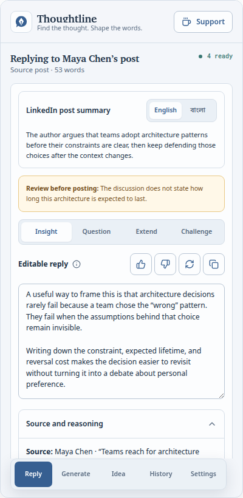
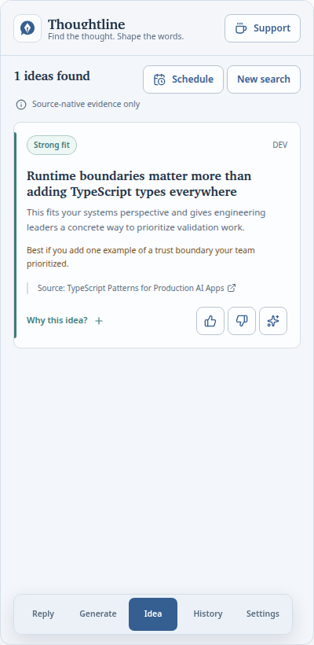
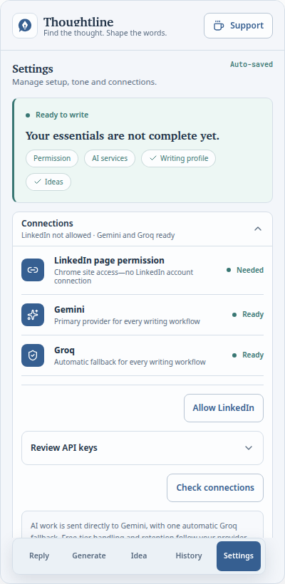

# Thoughtline

Thoughtline is a user-controlled Chrome side-panel extension for understanding a selected LinkedIn conversation and shaping writing in your own voice. It creates four reply directions, rewrites pasted content, researches post ideas, and keeps editable work history. It never publishes for you.

> Status: functional development release for Chrome 120+. Scheduling is a visual preview only; it does not run jobs or send email until the separate scheduling API is integrated.

## Latest release: v0.1.3

- Rebuilt the extension as **Thoughtline**, with a five-view side-panel workspace for Reply, Generate, Ideas, History, and Settings.
- Added staged LinkedIn context analysis, four independently editable reply directions, sourced idea research, experience-based post drafting, and editable work history.
- Added explicit AI consent, on-demand host permissions, encrypted provider credentials, incognito-safe storage, data import/export, storage recovery, and reviewable personalization.
- Added Gemini-first generation with one Groq fallback, typed provider and source adapters, bounded untrusted-content envelopes, and guarded LinkedIn layout calibration.
- Added production onboarding and Terms views, responsive and accessible UI coverage, immutable visual baselines, real-writer journey tests, and AI response-quality checks.
- GitHub releases now include the WXT Chrome ZIP and `SHA256SUMS.txt` after the complete static, unit, build, browser, visual, and accessibility gates pass.

## Product tour

| Reply from one selected LinkedIn post     | Find one idea per enabled source         | Configure local, reviewable behavior            |
| ----------------------------------------- | ---------------------------------------- | ----------------------------------------------- |
|  |  |  |

The screenshots above are captured from the production extension at the canonical 400 × 820 side-panel viewport and are also enforced as visual-regression baselines.

## What works

- Right-click one already-rendered LinkedIn post, comment, or reply and choose **Draft a reply with Thoughtline**.
- Passively extract only that selected post context and its visible discussion. Thoughtline does not click, scroll, expand, fetch LinkedIn pages, or read unrelated posts.
- Generate bilingual post summaries and four independently editable reply directions: Insight, Question, Extend, and Challenge.
- Paste content into **Generate** and rewrite it in the configured voice.
- Search Hacker News, DEV, Medium, Lobsters, and Stack Overflow when enabled, with at most one idea selected from each source. Every source reference links to the original item.
- Build an editable LinkedIn post from a sourced idea or a real experience supplied by the user.
- Search, filter, edit, revise, delete, clear, retain, export, and import Reply, Rewrite, and Idea history.
- Configure writing language, length, tone, custom instructions, writing samples, and a reviewable style guide.
- Derive an editable profile suggestion locally from the user's own LinkedIn PDF export; the raw PDF is not retained.
- Learn inspectable writing preferences only from explicit ratings, selected directions, and substantial edits.
- Use Gemini first and Groq once as automatic fallback through one provider port. Both valid API keys are required.
- Preserve one active workspace per Chrome session and enforce one foreground AI job globally.

## Install from a GitHub release

Thoughtline is distributed as a GitHub release rather than through the Chrome Web Store.

1. Download the Chrome ZIP and `SHA256SUMS.txt` from the release.
2. Verify the archive before installing:

   ```bash
   sha256sum --check SHA256SUMS.txt
   ```

3. Extract the ZIP to a stable folder. Do not delete that folder while the extension is installed.
4. Open `chrome://extensions` in Chrome 120 or later.
5. Turn on **Developer mode**.
6. Select **Load unpacked**, then choose the extracted folder containing `manifest.json`.
7. Open Thoughtline from the toolbar and complete setup.

To update a sideloaded installation, download and verify the next release, replace the extracted folder, and select **Reload** on `chrome://extensions`. Export a Data Archive first when moving the installation to another Chrome profile or device.

## First-time setup

Thoughtline asks only when a capability needs permission:

1. Review and accept direct AI processing consent.
2. Allow access to LinkedIn pages. This is page permission, not LinkedIn OAuth or an account connection.
3. Enter and validate both a [Gemini API key](https://aistudio.google.com/app/apikey) and a [Groq API key](https://console.groq.com/keys).
4. Add a role, topics, and audience. PDF profile import is optional.
5. Optionally enable public research sources as you use Idea search.

Provider keys are encrypted at rest with AES-256-GCM and a non-exportable device key before being placed in Chrome extension storage. They are excluded from exports, diagnostics, and History. Encryption at rest is not a defense against a compromised browser or operating system.

## Reply workflow

1. Open LinkedIn and make sure the post and discussion you want analyzed are already visible in the DOM.
2. Right-click inside the post, comment, or reply you intend to answer.
3. Select **Draft a reply with Thoughtline** from Chrome's menu.
4. Thoughtline opens the side panel, validates a bounded content envelope, and runs Gemini with Groq fallback.
5. Review the summary and warning, switch among four directions, edit the selected text, rate or regenerate it, and copy it.
6. Paste and publish manually on LinkedIn.

For a post target, visible rendered threads inside that post are included. For a comment or reply target, only its rendered parent thread is included. Hidden, collapsed, paginated, and unloaded content is excluded.

## Privacy and safety

- No LinkedIn automation, posting, scrolling, clicking, or hidden-content expansion.
- No raw HTML or DOM is sent to an AI provider.
- Names and visible text are kept because the user authorized analysis of that context.
- Untrusted source text is normalized, bounded, Zod-validated, and separated from trusted instructions; it is not treated as an instruction.
- AI work is sent directly to Gemini and, only on an eligible failure, once to Groq.
- History uses `chrome.storage.local`; session work and the global job lease use `chrome.storage.session`.
- Incognito mode uses split storage and does not persist work to History.
- No analytics or remote telemetry is included.
- Public-source permissions are optional and requested on demand. Turning a source off stops its use without revoking its existing Chrome permission.
- Schedule controls are non-operational preview UI and do not claim a running schedule.

See [PRIVACY.md](PRIVACY.md) and [SECURITY.md](SECURITY.md) for the complete boundaries.

## Development

### Requirements

- Node.js 24+
- pnpm 11.7+
- Chrome/Chromium 120+

### Start and build

```bash
pnpm install
pnpm dev
pnpm build
```

For live UI development, run `pnpm dev`. WXT opens a development browser with Thoughtline loaded and automatically refreshes the extension when source files change. If you prefer your existing Chrome profile, load `.output/chrome-mv3-dev` once while `pnpm dev` is running; keep the dev server running for subsequent updates.

Load `.output/chrome-mv3` only for a production-build smoke test. Changes in that directory require `pnpm build` followed by an extension reload, so it is not the live-development target.

### Quality gates

```bash
pnpm format:check
pnpm lint
pnpm typecheck
pnpm test
pnpm test:e2e
pnpm test:prototype
pnpm test:journey
pnpm test:ai
pnpm check
pnpm release:zip
```

`pnpm test:e2e` launches the packed Manifest V3 extension in Chromium, checks responsive navigation at 400px and 320px, runs Axe against all five views, and compares production UI screenshots. Unit tests cover extraction boundaries, untrusted envelopes, encrypted credentials, provider fallback, storage migration/recovery/retention, data archives, and feedback behavior. See [tests/TEST-PLAN.md](tests/TEST-PLAN.md) for the approved-prototype contract, real-writer journey matrix, and AI quality gates.

Husky runs `lint-staged` before commits after the project is installed inside a Git checkout. CI repeats the full static, unit, production-build, browser, accessibility, and visual checks.

## Architecture

```text
entrypoints/                  WXT background, LinkedIn content, onboarding, side panel
src/domain/                  Zod schemas, invariants, and domain types
src/application/             Workflows, ports, feedback, archive, provider orchestration
src/infrastructure/          Chrome storage, credential vault, providers, source adapters
src/content/                 Passive LinkedIn DOM extraction
src/ui/                      React features, hooks, local shadcn-style Radix primitives
tests/unit/                  Boundary and behavior tests
tests/e2e/                   Packed-extension visual, responsive, and accessibility tests
prototypes/                  Immutable, numbered prototype history
docs/adr/                    Architectural decision records
```

The feature code depends on typed ports rather than provider-specific response shapes. Gemini and Groq share the same validated request contract, so another provider can be introduced by implementing `DraftingProvider`. Source research follows the same adapter boundary. Shared UI primitives use Tailwind CSS v4 and Radix; there is no component-level vanilla CSS.

The domain language and non-negotiable behavior live in [CONTEXT.md](CONTEXT.md). Architectural decisions live in [docs/adr](docs/adr), and [prototypes/reference.json](prototypes/reference.json) always identifies the approved immutable visual contract.

## Release

Update the package and extension version, refresh `.github/RELEASE_NOTES.md`, and push a matching `v*` tag:

```bash
VERSION=v0.1.3
git tag "$VERSION"
git push origin "$VERSION"
```

The release workflow installs dependencies, runs unit/static/build checks and the real-browser UI suite, creates the WXT Chrome ZIP, generates SHA-256 checksums, and publishes both with the prepared release notes.

## License

[MIT](LICENSE)
